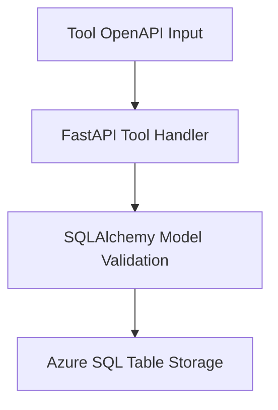

# Data Schema Flow: From Tool Input to SQL Storage

This document summarizes the data flow and schema alignment from frontend tools to database persistence for the Concussion Recovery Assistant.

---

## Overview

Each tool in the system follows a pipeline:
1. **Tool Input Schema (OpenAPI)** – Defines how data should be submitted.
2. **FastAPI Route Handlers** – Handle requests, validate inputs, and trigger logic.
3. **db_models (SQLAlchemy)** – Define table schema and validation rules.
4. **SQL Table (Azure SQL)** – Final persistence layer.

---

## Tools and Schema Mapping

### `log_incident_detail`
- **Tool Input:**
  - `user_id`, `timestamp`, `answers` dict (with incident details and symptoms)
- **FastAPI Handler:** Validates and stores into `IncidentReport`, `SymptomLog`, `TriageResponse`
- **Models:**
  - `IncidentReport`
  - `SymptomLog` (for symptoms + scores)
  - `TriageResponse` (optional audit log)
- **SQL Tables:**
  - `incident_report_export`
  - `symptom_log_export`
  - `triage_response_export`

### `log_symptoms`
- **Tool Input:**
  - `user_id`, `timestamp`, `symptoms[]` (each with `symptom_input`, `score`, `notes`)
- **FastAPI Handler:** Validates, maps symptoms, stores each as row
- **Models:** `SymptomLog`
- **SQL Table:** `symptom_log_export`

### `assess_concussion`
- **Tool Input:** `user_id`
- **FastAPI Handler:**
  - Fetch latest symptoms from `SymptomLog`
  - Match to YAML for red flags/risk
  - Store results
- **Model:** `ConcussionAssessment`
- **SQL Table:** `concussion_assessment_export`

### `get_stage_guidance`
- **Tool Input:** `user_id` or fallback `answers` for recovery check
- **FastAPI Handler:**
  - Retrieve `SymptomLog` and assess stage
  - Optionally stores `RecoveryCheck`
- **Models:** `StageLog`, `RecoveryCheck`
- **SQL Tables:** `stage_result_export`, `recovery_check_export`

### `export_summary`
- **Tool Input:** `user_id`
- **Handler:**
  - Queries all relevant tables via `db_reader.py`
  - Formats into PDF and FHIR
- **Tables Queried:**
  - `incident_report_export`
  - `symptom_log_export`
  - `concussion_assessment_export`
  - `stage_result_export`

---

## Flow Summary

Each stage enforces schema constraints and helps with traceability, debugging, and validation across the data lifecycle.

---

## Related Files
- OpenAPI: `app/openapi.json`
- Routes: `app/tools/*.py`
- Models: `app/db/db_models.py`
- Tables: Azure SQL via `init_schema.sql`, Azure Data Studio

---

This document will help ensure schema consistency across the stack and onboard future contributors quickly.